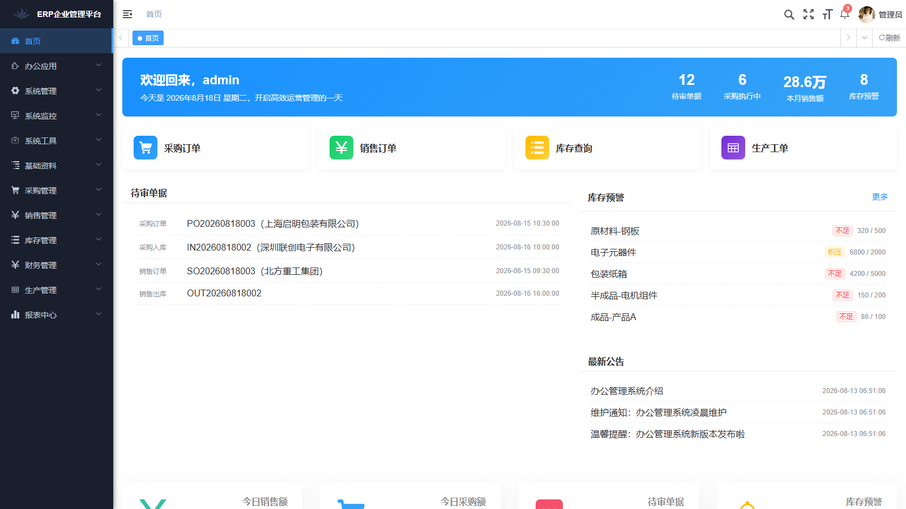
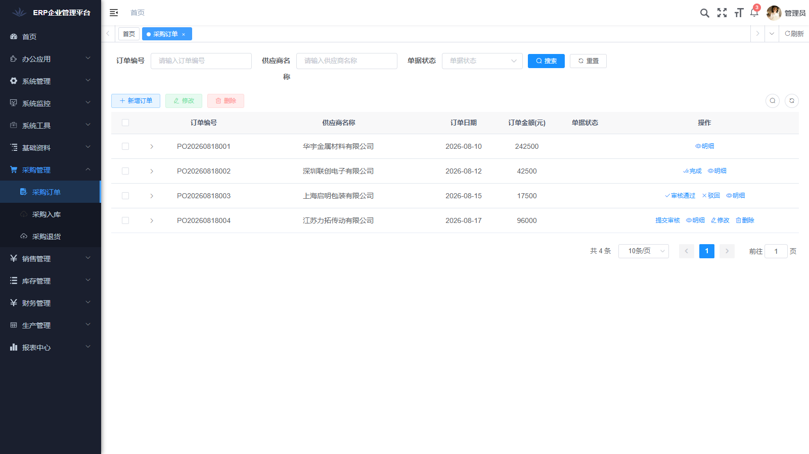
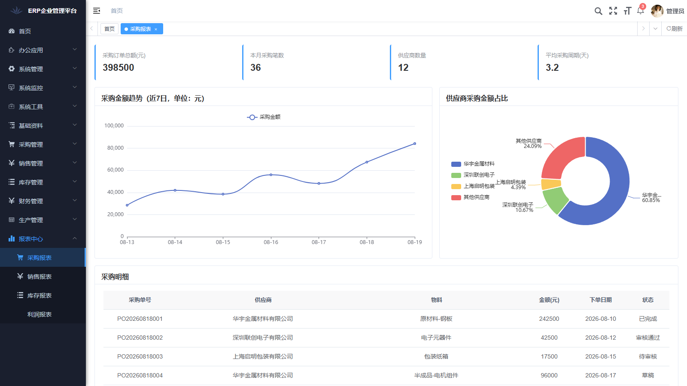
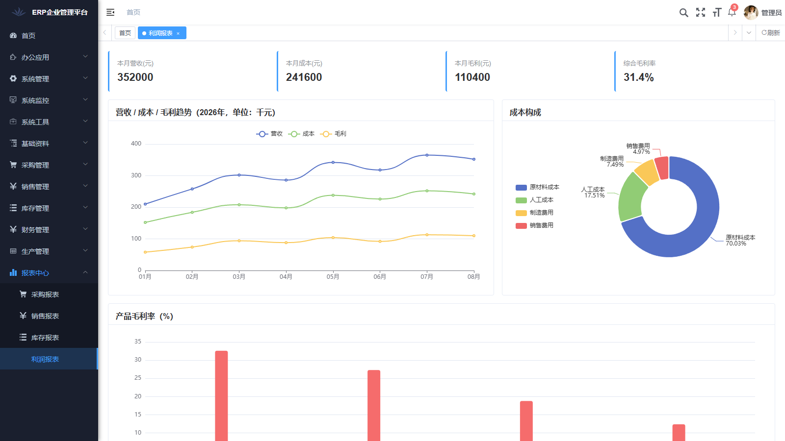

<p align="center">
	
</p>
<h1 align="center" style="margin: 30px 0 30px; font-weight: bold;">ERP 企业管理平台</h1>
<h4 align="center">基于 RuoYi-Cloud 二次开发的进销存生产一体化管理系统（演示项目）</h4>
<p align="center">
	<a href="https://github.com/ShiroWei/RuoYi-ERP-demo"></a>
	<a href="https://github.com/ShiroWei/RuoYi-ERP-demo/blob/master/LICENSE"></a>
</p>

## 平台简介

ERP 企业管理平台是一套**演示性质**的企业资源计划（ERP）管理系统，覆盖**基础资料、采购、销售、库存、财务、生产**六大核心业务域。项目在开源框架 [RuoYi-Cloud v3.6.8](https://gitee.com/y_project/RuoYi-Cloud)（Spring Boot 4.1.0 / Spring Cloud Alibaba / Vue 2 + Element UI）基础上二次开发。

* 六大业务域完整页面：物料/供应商/客户/仓库、采购订单/入库/退货、销售订单/出库/退货、库存台账/出入库/盘点/调拨、应收/应付/收付款、BOM/生产工单。
* **单据统一审核流**：全部业务单据（采购/销售/库存/财务/生产）支持「草稿 → 提交审核 → 审核通过 / 驳回 → 完成」的完整状态流转。
* **报表中心**：采购/销售/库存/利润四大报表，KPI 卡片 + 趋势折线 + 占比饼图 + 排名柱状 + 明细表格。
* **前后端真实接口**：前端页面与后端微服务（ruoyi-modules-erp）接口完整打通，主从表（采购/销售订单、BOM）与单头单据（入库/出库/退货）字段对齐。
* **库存联动**：采购入库、销售出库、库存调拨单据「完成」后自动更新库存台账（入库加库存、出库减库存、调拨两仓增减），库存不足自动拦截。
* **AI 智能助手**：对话式经营助手，支持销售/采购/利润/库存分析、库存预警、待审汇总、订单草稿生成（规则 Mock 意图引擎，回复中的经营数字取自真实报表接口，不接入任何真实 AI 服务）。
* ERP 工作台首页：经营统计卡片、待审单据（与各单据模块联动、可点击直达）、库存预警、经营趋势图表。
* 配套 SQL 脚本：22 张业务表 DDL、ERP 菜单、字典、角色授权、演示种子数据（档案 + 全流程示例单据），一键导入；另附一键启动/停止脚本。

## 功能特性

| 业务域 | 功能模块 | 说明 |
| :--- | :--- | :--- |
| 工作台 | ERP 工作台 | 统计卡片、待审单据（点击直达）、库存预警、经营图表、快捷入口 |
| 基础资料 | 物料管理 | 物料编码/分类/规格/单价/安全库存 |
| 基础资料 | 供应商管理 | 供应商档案/类型/联系人/银行信息 |
| 基础资料 | 客户管理 | 客户档案/等级/信用额度 |
| 基础资料 | 仓库管理 | 仓库档案/类型/负责人 |
| 采购管理 | 采购订单 | 订单头 + 明细行（物料/数量/单价自动算金额） |
| 采购管理 | 采购入库 | 入库单，关联采购订单与仓库，完成自动入库 |
| 采购管理 | 采购退货 | 退货单，关联采购订单与仓库 |
| 销售管理 | 销售订单 | 订单头 + 明细行 |
| 销售管理 | 销售出库 | 出库单，关联销售订单与仓库，完成自动出库 |
| 销售管理 | 销售退货 | 退货单，关联销售订单与仓库 |
| 库存管理 | 库存查询 | 实时库存台账，安全库存预警高亮 |
| 库存管理 | 出入库记录 | 采购入库/销售出库/生产领料/调拨等类型 |
| 库存管理 | 库存盘点 | 单行盘点单，账实对比自动计算差异 |
| 库存管理 | 库存调拨 | 仓库间调拨，完成自动两仓增减 |
| 财务管理 | 应收账款 | 应收/已收/未收金额、结清状态 |
| 财务管理 | 应付账款 | 应付/已付/未付金额、结清状态 |
| 财务管理 | 收付款管理 | 收款/付款流水登记 |
| 生产管理 | BOM 物料清单 | 产成品 + 单耗用量清单 |
| 生产管理 | 生产工单 | 计划数量/开工完工日期/完工数量/状态 |
| 报表中心 | 采购报表 | KPI 卡片、采购趋势、供应商占比、采购明细 |
| 报表中心 | 销售报表 | KPI 卡片、销售趋势、产品排名、销售明细 |
| 报表中心 | 库存报表 | KPI 卡片、出入库趋势、仓库分布、库存明细 |
| 报表中心 | 利润报表 | KPI 卡片、营收/成本/毛利趋势、成本构成、利润明细 |
| 智能助手 | AI 助手 | 对话式经营分析、库存预警、待审汇总、订单草稿生成（Mock 引擎） |

> **单据审核流**：所有单据状态统一为 `草稿(0) → 待审核(1) → 审核通过(2)/已驳回(3) → 已完成(4)`，按状态动态显示「提交审核 / 审核通过 / 驳回 / 完成 / 重新提交」操作按钮，仅草稿可修改删除。

## 技术栈

| 组件 | 版本 |
| :--- | :--- |
| JDK | 24 |
| Spring Boot | 4.1.0 |
| Spring Cloud | 2025.1.2 |
| Spring Cloud Alibaba | 2025.1.0.0 |
| Nacos | 3.x |
| Redis | 最新稳定版 |
| Vue | 2.x |
| Element UI | 2.15.x |
| MySQL | 8.x |

## 演示账号

| 账号 | 密码 | 角色 |
| :--- | :--- | :--- |
| admin | admin123 | 管理员 |

## 界面预览

| 登录页 | ERP 工作台 |
| :---: | :---: |
|  |  |
| 采购订单（含审核流） | 报表中心-采购报表 |
|  |  |
| 报表中心-利润报表 | |
|  | |

## 本地开发环境

环境要求：JDK 24+、Maven 3.9+、Node 16/18/20、MySQL 8、Redis、Nacos 3.x。

**一键脚本**（Windows）：

1. 初始化数据库：`scripts\setup-db.bat`（自动建库并导入全部 SQL）。
2. 启动全栈：`scripts\start-all.bat`（Nacos + Redis + 后端微服务 + 前端）。
3. 停止服务：`scripts\stop-all.bat`。

手动方式：

1. 导入数据库脚本（先建库 `ry-cloud`）：`sql/ry_20260417.sql`、`sql/ry_config_20260611.sql`、`sql/ry_erp_20260818.sql`、`sql/ry_erp_20260819.sql`，最后导入演示数据 `sql/ry_erp_seed_20260819.sql`。
2. 启动 Nacos（3.0.2，默认端口 8848）。
3. 依次启动后端微服务：`ruoyi-gateway`(8000) → `ruoyi-auth` → `ruoyi-modules-system` → `ruoyi-modules-job` → `ruoyi-modules-erp`(9202) 等。
4. 前端：`cd ruoyi-ui && npm install && npm run dev`（默认端口 80，若被系统保留端口占用会回退到 8081，代理指向网关 8000）。

详细说明见 [docs/本地开发环境配置.md](docs/本地开发环境配置.md)。

## 目录结构

```
ruoyi-ui/                  # 前端（Vue 2 + Element UI）
  src/api/erp/             # ERP 接口 API（base/purchase/sale/stock/finance/production/report）
  src/views/erp/           # ERP 页面（base/purchase/sale/stock/finance/production/report）
  src/views/dashboard/     # ERP 工作台
ruoyi-gateway/             # 网关（端口 8000）
ruoyi-auth/                # 认证中心
ruoyi-modules-system/      # 系统模块
ruoyi-modules-erp/         # ERP 业务模块（端口 9202）
sql/                       # 数据库脚本（含 ERP 业务表/菜单/字典/报表中心/演示种子数据）
scripts/                   # 一键脚本（setup-db / start-all / stop-all）
docs/                      # 本地开发环境配置文档 + 界面截图
```

## 上游来源

本项目基于 [RuoYi-Cloud v3.6.8](https://gitee.com/y_project/RuoYi-Cloud) 二次开发，遵循 MIT License，保留上游完整提交历史。若依官方文档见 [RuoYi 官网](https://ruoyi.vip)。
